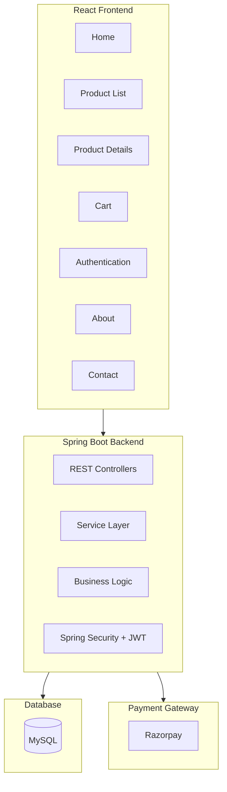
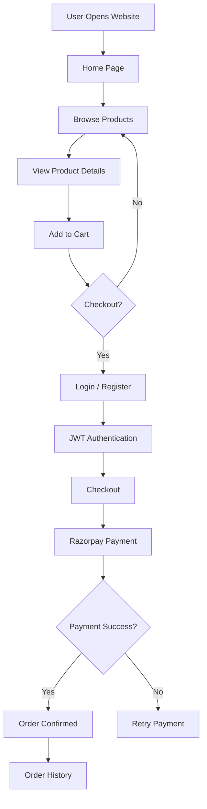
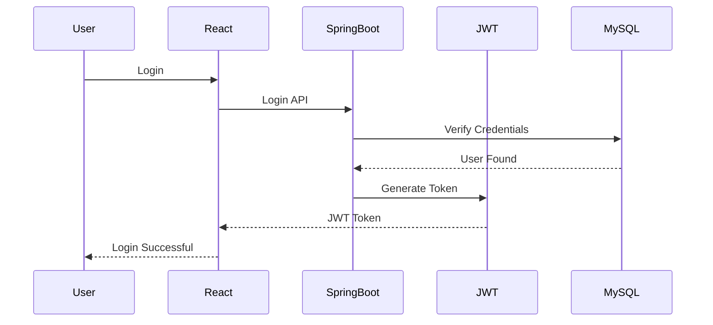
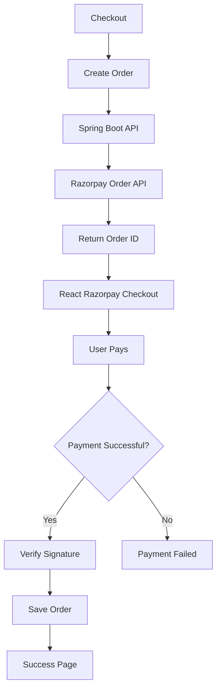
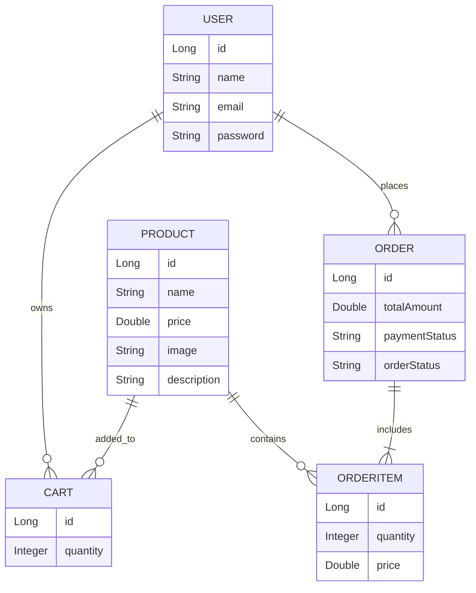
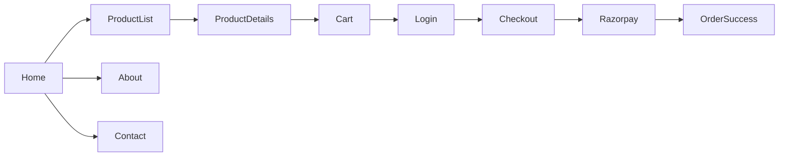

<div align="center">

# 🛒 E-Commerce Application
### Full Stack Online Shopping Platform using Spring Boot, React & Razorpay

[](https://react.dev/)
[](https://spring.io/projects/spring-boot)
[](https://www.mysql.com/)
[](https://razorpay.com/)
[](https://jwt.io/)
[](LICENSE)

**A full-stack E-Commerce platform that enables users to browse products, manage shopping carts, securely authenticate, and complete online payments using Razorpay.**

[Features](#-key-features) • [Architecture](#️-system-architecture) • [Workflow](#-application-workflow) • [Screens](#-application-modules)

</div>

---

# 📖 Project Overview

The **E-Commerce Application** is a modern online shopping platform built using **Spring Boot**, **React**, and **MySQL**. It provides a seamless shopping experience with secure authentication, product browsing, shopping cart management, and online payment integration using **Razorpay**.

---

# ✨ Key Features

- 🔐 JWT Authentication
- 👤 User Registration & Login
- 🏠 Home Page
- 📦 Product Listing
- 🔍 Product Details
- 🛒 Shopping Cart
- 💳 Razorpay Payment Gateway
- 📞 Contact Page
- ℹ️ About Page
- 📱 Responsive User Interface
- ⚡ REST API Integration
- 🗄️ MySQL Database

---

# 🛠 Technology Stack

| Technology | Purpose |
|------------|---------|
| React.js | Frontend |
| Spring Boot | Backend |
| Spring Security | Authentication |
| JWT | Secure Login |
| MySQL | Database |
| JPA/Hibernate | ORM |
| Razorpay | Online Payment |
| REST API | Client-Server Communication |
| Bootstrap / CSS | UI Design |

---

# 📂 Project Structure

```
Frontend (React)

src
│
├── About
├── Auth
├── Cart
├── Contact
├── Home
├── ProductDetails
├── ProductList
├── Services
├── Components
├── App.js
└── index.js


Backend (Spring Boot)

src
│
├── controller
├── service
├── repository
├── entity
├── dto
├── security
├── config
└── EcommerceApplication.java
```

---

# 🏗️ System Architecture



---

# 🔄 Application Workflow



---

# 🔐 Authentication Flow



---

# 💳 Razorpay Payment Flow



---

# 🗄 Database Design



---

# 📱 Application Modules

| Module | Description |
|---------|-------------|
| 🏠 Home | Landing Page |
| 🔐 Authentication | Login & Register |
| 📦 Product List | View Products |
| 🔍 Product Details | Product Information |
| 🛒 Cart | Shopping Cart |
| 💳 Razorpay | Online Payment |
| 📞 Contact | Contact Form |
| ℹ️ About | Company Information |

---

# 📲 Screen Navigation



---

# 🚀 Installation

## Clone Repository

```bash
git clone https://github.com/garajesh/ecommerce-application.git
```

## Backend

```bash
cd backend

mvn spring-boot:run
```

## Frontend

```bash
cd frontend

npm install

npm start
```

---

# 💳 Razorpay Integration

1. Create a Razorpay Account.
2. Generate **Key ID** and **Secret Key**.
3. Configure Spring Boot backend with Razorpay credentials.
4. Create Razorpay Orders using REST API.
5. Integrate Razorpay Checkout in React.
6. Verify Payment Signature.
7. Save Order Details in MySQL.

---

# 📈 Future Enhancements

- ❤️ Wishlist
- ⭐ Product Reviews
- 📦 Order Tracking
- 🔔 Email Notifications
- 📱 Mobile Application
- 🎟 Coupon System
- 🤖 AI Product Recommendation
- 📊 Admin Dashboard
- 📈 Sales Analytics

---

<div align="center">

## ⭐ Support

If you found this project useful, please consider giving it a **Star ⭐** on GitHub.

Made with ❤️ using **Spring Boot, React & Razorpay**

</div>
